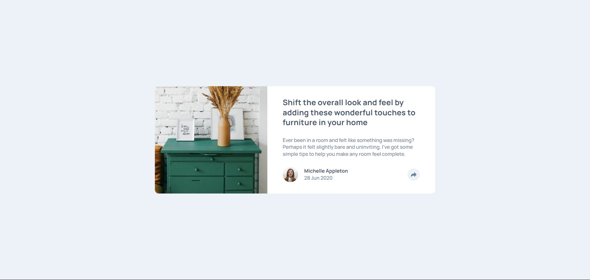

# Frontend Mentor - Article preview component solution

This is a solution to the [Article preview component challenge on Frontend Mentor](https://www.frontendmentor.io/challenges/article-preview-component-dYBN_pYFT). Frontend Mentor challenges help you improve your coding skills by building realistic projects.

## Table of contents

- [Overview](#overview)
  - [The challenge](#the-challenge)
  - [Screenshot](#screenshot)
  - [Links](#links)
- [My process](#my-process)
  - [Built with](#built-with)
  - [What I learned](#what-i-learned)
  - [Continued development](#continued-development)
  - [Useful resources](#useful-resources)
  - [AI Collaboration](#ai-collaboration)
- [Author](#author)
- [Acknowledgments](#acknowledgments)

## Overview

### The challenge

Users should be able to:

- View the optimal layout for the component depending on their device's screen size
- See the social media share links when they click the share icon
- Experience accessible interaction patterns with proper ARIA attributes

### Screenshot



### Links

- Solution URL: [https://github.com/runny-life/article-preview-component](https://github.com/runny-life/article-preview-component)
- Live Site URL: [https://runny-life.github.io/article-preview-component/](https://runny-life.github.io/article-preview-component/)

## My process

### Built with

- Semantic HTML5 markup
- CSS custom properties (variables)
- Flexbox
- CSS Grid
- Mobile-first workflow
- `clamp()` for fluid typography and responsive sizing
- CSS `:open` pseudo-class for dialog styling
- Vanilla JavaScript (ES6+)
- Accessible UI patterns (ARIA attributes)

### What I learned

This project reinforced several key front-end development concepts:

**1. Semantic HTML & Accessibility**

I used semantic elements like `<article>`, `<main>`, `<dialog>`, `<time>`, and appropriate ARIA attributes to ensure the component is accessible.

```html
<dialog class="modal" id="share-dialog" data-js-modal>
  <!-- dialog content -->
</dialog>

<button
  class="button"
  type="button"
  aria-label="Share article"
  aria-expanded="false"
  aria-controls="share-dialog"
  data-js-toggle-button
></button>
```

**2. Responsive Layout with CSS Grid**

The card layout transitions from a stacked column on mobile to a two-column grid on desktop:

```css
.card {
  display: grid;
  width: clamp(20.438rem, 5.884rem + 62.096vw, 45.625rem);
}

@media (min-width: 768px) {
  .card {
    grid-template-columns: 40.12% 1fr;
  }
}
```

**3. Dialog API & JavaScript State Management**

Using the native `<dialog>` element with `.show()` and `.close()` methods, while keeping ARIA attributes in sync:

```javascript
function updateAriaExpanded() {
  if (toggleButton) {
    toggleButton.setAttribute("aria-expanded", modal?.open ? "true" : "false");
  }
}

modal?.addEventListener("close", updateAriaExpanded);
modal?.addEventListener("cancel", updateAriaExpanded);
```

**4. CSS Tooltip with Pseudo-elements**

The desktop version features a tooltip-style modal with a triangular pointer created using `clip-path`:

```css
.modal::after {
  content: "";
  position: absolute;
  bottom: -13px;
  left: 50%;
  transform: translateX(-50%);
  width: 45px;
  height: 20px;
  background: var(--gray-900);
  clip-path: polygon(0 0, 100% 0, 50% 100%);
}
```

**5. Fluid Typography & Spacing**

Using `clamp()` for responsive sizing without media queries:

```css
.card {
  width: clamp(20.438rem, 5.884rem + 62.096vw, 45.625rem);
}
```

### Continued development

In future projects, I want to focus on:

- **Advanced accessibility**: Deepening my understanding of screen reader interactions and keyboard navigation for complex UI patterns
- **Animation & transitions**: Adding subtle micro-interactions to enhance user experience
- **Performance optimization**: Lazy loading images and optimizing asset delivery
- **JavaScript patterns**: Exploring more robust state management patterns for UI components
- **Testing**: Implementing unit and integration tests for interactive components

### Useful resources

- [MDN Web Docs - `<dialog>` element](https://developer.mozilla.org/en-US/docs/Web/HTML/Element/dialog) - Helped me understand the native dialog API and its accessibility implications.
- [CSS `clamp()` function](https://developer.mozilla.org/en-US/docs/Web/CSS/clamp) - Essential for creating fluid, responsive typography and layouts.
- [ARIA Authoring Practices Guide](https://www.w3.org/WAI/ARIA/apg/) - Invaluable reference for accessible component patterns.
- [Frontend Mentor Community](https://www.frontendmentor.io/community) - Great source of inspiration and feedback from other developers.

### AI Collaboration

- **Tools used**: I used AI assistance (such as ChatGPT/Claude) to help with:
  - Brainstorming responsive layout strategies
  - Debugging the dialog modal toggle functionality
  - Reviewing accessibility best practices
  - Generating this README template structure
- **What worked well**: The AI provided helpful suggestions for CSS techniques like `clamp()` and the `:open` pseudo-class, and offered clear explanations of the dialog API.
- **What didn't work**: Some generated code needed adjustment to match the specific project requirements, particularly around the modal positioning and state management.

## Author

- Frontend Mentor - [@runny-life](https://www.frontendmentor.io/profile/runny-life)
- GitHub - [@runny-life](https://github.com/runny-life)

## Acknowledgments

This project was completed as part of the Frontend Mentor challenge platform. Special thanks to the Frontend Mentor community for providing such excellent design challenges that help developers sharpen their skills through real-world projects.
